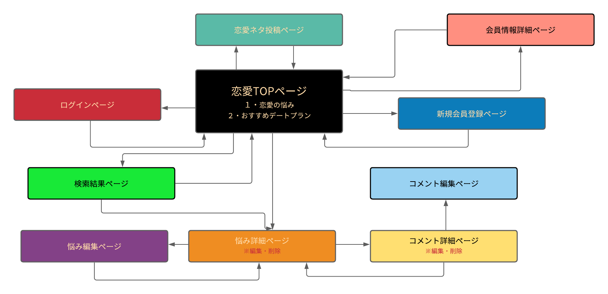

# アプリケーション名
<h2>ラブライク</h2>

# アプリケーション概要
恋の悩みを話し合って解決する

# URL
https://love-dating-33453.herokuapp.com/

# サンプル用アカウント
メールアドレス watar.wind.xyz1990@gmail.com 
パスワード     111111a

# Basic認証
ID   admin 
Pass 2222 

# 利用方法
老若男女とわず、恋愛で困っている人が悩みを投稿し、閲覧者がアドバイスを送信する。 
必要であれば、投稿者がアドバイザーにコメントもできる 

# 目指した課題解決

恋愛で悩んでいて身近な人に相談できないという課題 
せっかくアドバイスしても投稿者が読んでくれているかわからない課題 
すでに解決済みなのか、まだ悩んでいるのかわからない課題 

# 洗い出した要件

これは赤文字です

１・ユーザー管理機能
 

２・記事一覧表示機能
 

３・記事投稿機能
 

４・記事詳細表示機能
 

５・コメント投稿機能
 

６・記事編集機能
 

７・記事削除機能
 

８・コメント編集機能
 

９・コメント削除機能
 

１０・記事検索機能
 

１１・既読機能
 

１２・観閲済み機能(いいね機能)
 

１３・ページネーション機能
 

１４・解決済み機能
 

１５・エラーハンドリング機能
 

１６・ユーザー詳細表示機能
 

１７・コメント返信機能
 

# 実装した機能についての説明

<h5>ユーザー管理機能</h5> 
各ユーザーごとの機能を持たせるため、新規登録/ログイン/ログアウトができる 
<h5>記事一覧表示機能</h5> 
ユーザーが全ての記事を閲覧でき、投稿された記事はトップページに一覧で新しい順に左から表示 
<h5>記事投稿機能</h5> 
ログイン済みの各ユーザーが新しい記事を投稿できる。 
ログインユーザーのみ、記事投稿ページへ遷移できる 
ログアウトユーザーは、記事投稿ページへ遷移できず記事を投稿できない 
<h5>記事詳細表示機能</h5> 
全ユーザーが選択した記事の全文と閲覧数を見ることができる 
<h5>コメント投稿機能</h5> 
投稿者に対してアドバイスができ、投稿者はアドバイザーに対して返信ができる 
<h5>記事編集機能</h5> 
投稿した記事に対して補足や修正したい場合、記事の内容を編集できる 
<h5>記事削除機能</h5> 
投稿者は自分の投稿した記事に対して削除したい場合、削除できるようにする 
<h5>コメント編集機能</h5> 
ログインユーザーは投稿したコメントに対して補足や修正したい場合、コメントの内容を編集できる 
<h5>コメント削除機能</h5> 
ログインユーザーは、投稿したコメントに対して削除したい場合、削除できる 
<h5>記事検索機能</h5> 
複数条件を指定した上で閲覧したい記事の検索を可能にする 
<h5>既読機能</h5> 
記事投稿者がコメントを読了をした事をコメント投稿ユーザーに知らせる 
<h5>観閲済み機能(いいね機能)</h5> 
記事投稿者に何人観閲してもらえているかを知らせるため、詳細ページにて「観閲済みマークをつける」を クリックするとプラスで１加算され、トップページ及び詳細ページにて観閲数の確認が可能。
<h5>ページネーション機能</h5> 
記事が大量にある場合、より詳しい情報に基づいた記事を閲覧するため、トップページを見やすくする。
<h5>解決済み機能</h5> 
投稿者以外のユーザー及び、未ログインユーザーを安心させるために、投稿者以外に悩みが解決したことを知らせる
<h5>エラーハンドリング機能</h5> 
新規投稿・記事投稿・コメント投稿を行う際、どの部分でエラーが発生しているかをユーザーに知らせる
<h5>ユーザー詳細表示機能</h5> 
各ユーザーのプロフィールを確認することができる 
<h5>コメント返信機能</h5> 
アドバイスをくれたコメント主に対して、お礼などのコメントを直下に表示させることがコメント主のお礼の閲覧が容易となる

# 実装予定の機能

コメント返信機能については今後実装予定

# データベース設計   

## users テーブル                              
| Column             | Type   | Options      |
| --------           | ------ | -----------  |
| nickname           | string | null: false  |
| email              | string | unique: true |
| encrypted_password | string | null: false  |
| seibetu_id         | string | null: false  |
| age                | string | null: false  |
| work               | string | null: false  |

### アソシエーション
- belongs_to :seibetu
- belongs_to :work

- has_many :romances
- has_many :comments
- has_many :likes

## romances テーブル
| Column           | Type       | Options     |
| ------           | ------     | ----------- |
| user             | referrence | null: false, foreign_key: true |
| title            | string     | null: false |
| info1            | text       | null: false |
| kaiketu          | boolean    | null: false |

### アソシエーション
- belongs_to :user

- has_one_attached :image
- has_many         :comments
- has_many         :likes

## comments テーブル

| Column     | Type       | Options                        |
| ------     | ---------- | ------------------------------ |
| user       | references | null: false, foreign_key: true |
| romance    | references | null: false, foreign_key: true |
| text       | text       | null: false |

### アソシエーション

- belongs_to :user
- belongs_to :romance

## likes テーブル
| Column     | Type       | Options                        |
| ------     | ---------- | ------------------------------ |
| user       | references | null: false, foreign_key: true |
| romance    | references | null: false, foreign_key: true |

### アソシエーション
- belongs_to :user
- belongs_to :romance

# ローカルでの動作方法

rails バージョン 6.0.0

ruby  バージョン 2.6.5

<h1>git cloneしてから、ローカルで動作をさせるまでに必要なコマンド</h1>

git clone https://github.com/nishikawa-naonori/love-dating-33453.git

bundle install

rails db:create

rails db:migrate

rails s