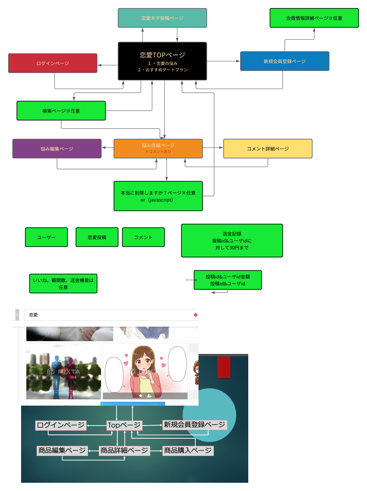

# アプリケーション名
<h2>ラブライク</h2>

# アプリケーション概要
恋の悩みを話し合って解決する

# URL
https://love-dating-33453.herokuapp.com/

# テスト用アカウント
メールアドレス watar.wind.xyz1990@gmail.com 
パスワード     111111a

# Basic認証
ID   admin 
Pass 2222 

# 利用方法
老若男女とわず、恋愛で困っている人が悩みを投稿し、閲覧者がアドバイスを送信する。 
必要であれば、投稿者がアドバイザーにコメントもできる 

# 目指した課題解決

恋愛で悩んでいて身近な人に相談できないという課題 
せっかくアドバイスしても投稿者が読んでくれているかわからない課題 
すでに解決済みなのか、まだ悩んでいるのかわからない課題 

# 洗い出した要件

<h6>ユーザー管理機能</h6> 
新規登録/ログイン/ログアウトができる 
<h6>記事一覧表示機能</h6> 
<h6>記事投稿機能</h6> 
<h6>記事詳細表示機能</h6> 
<h6>コメント投稿機能</h6> 
<h6>記事編集機能</h6> 
<h6>記事削除機能</h6> 
<h6>コメント編集機能</h6> 
<h6>コメント削除機能</h6> 
<h6>記事検索機能</h6> 
<h6>既読機能</h6> 
<h6>観閲済み機能(いいね機能)</h6> 
<h6>ページネーション機能</h6> 
<h6>解決済み機能</h6> 
<h6>エラーハンドリング機能</h6> 
<h6>コメント返信機能</h6> 

# 実装した機能についてのGIFと説明

実装した機能について、それぞれどのような特徴があるのか列挙しましょう。GIFを添えることで、イメージがしやすくなります。

# 実装予定の機能

コメント返信機能については今後実装予定

# データベース設計   

## users テーブル                              
| Column             | Type   | Options      |
| --------           | ------ | -----------  |
| nickname           | string | null: false  |
| email              | string | unique: true |
| encrypted_password | string | null: false  |
| seibetu_id         | string | null: false  |
| age                | string | null: false  |
| work               | string | null: false  |

### アソシエーション
- belongs_to :seibetu
- belongs_to :work

- has_many :romances
- has_many :comments
- has_many :likes

## romances テーブル
| Column           | Type       | Options     |
| ------           | ------     | ----------- |
| user             | referrence | null: false, foreign_key: true |
| title            | string     | null: false |
| info1            | text       | null: false |
| kaiketu          | boolean    | null: false |

### アソシエーション
- belongs_to :user

- has_one_attached :image
- has_many         :comments
- has_many         :likes

## comments テーブル

| Column     | Type       | Options                        |
| ------     | ---------- | ------------------------------ |
| user       | references | null: false, foreign_key: true |
| romance    | references | null: false, foreign_key: true |
| text       | text       | null: false |

### アソシエーション

- belongs_to :user
- belongs_to :romance

## likes テーブル
| Column     | Type       | Options                        |
| ------     | ---------- | ------------------------------ |
| user       | references | null: false, foreign_key: true |
| romance    | references | null: false, foreign_key: true |

### アソシエーション
- belongs_to :user
- belongs_to :romance

# ローカルでの動作方法

rails バージョン 6.0.0

ruby  バージョン 2.6.5

<h1>git cloneしてから、ローカルで動作をさせるまでに必要なコマンド</h1>

git clone https://github.com/nishikawa-naonori/love-dating-33453.git

bundle install

rails db:create

rails db:migrate

rails s